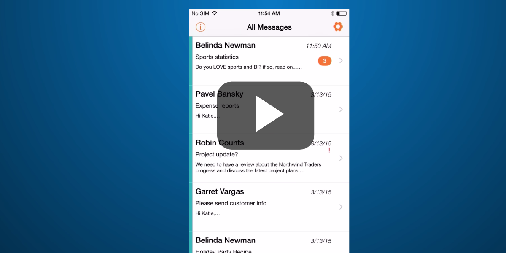

#Email Peek – um aplicativo iOS criado usando o Office 365 #

O Email Peek é um aplicativo de email interessante, criado por meio de APIs do Office 365 na plataforma iOS. Esse aplicativo permite ver apenas as conversas de email realmente importantes quando você está ausente, como quando estiver de férias. O Email Peek também facilita o envio de respostas rápidas às mensagens sem a necessidade de digitar. Esse aplicativo usa muitos dos recursos da API de Email do Office 365, como ler/gravar, filtragem do lado do servidor e categorias.

**Sumário**

* [Set up your environment](#set-up-your-environment)
* [Use CocoaPods to import the O365 iOS SDK](#use-cocoapods-to-import-the-o365-ios-sdk)
* [Registrar seu aplicativo no Microsoft Azure](#register-your-app-with-microsoft-azure)
* [Obter a ID de Cliente e URI de Redirecionamento no projeto](#get-the-client-id-and-redirect-uri-into-the-project)
* [Arquivos de código importantes](#code-of-interest)
* [Perguntas e comentários](#questions-and-comments)
* [Solução de problemas](#troubleshooting)
* [Recursos adicionais](#additional-resources)

## Configurar seu ambiente ##

Para executar o Email Peek, você precisa do seguinte:

* [Xcode](https://developer.apple.com/) da Apple.
* Uma conta do Office 365. Você pode obter uma conta do Office 365 ao se inscrever em um [Site do Desenvolvedor do Office 365](http://msdn.microsoft.com/library/office/fp179924.aspx). Isso dará acesso a APIs que você pode usar para criar aplicativos que visam dados do Office 365.
* Um locatário do Microsoft Azure para registrar seu aplicativo. O Azure Active Directory fornece serviços de identidade que os aplicativos usam para autenticação e autorização. Uma assinatura de avaliação pode ser adquirida aqui: [Microsoft Azure](https://account.windowsazure.com/SignUp).

**Importante**: você também deve assegurar que a assinatura do Azure esteja vinculada ao locatário do Office 365. Para fazer isso, confira a seção ** Adicionar um novo diretório** na postagem do blog da equipe do Active Directory, [Criando e Gerenciando Vários Microsoft Azure Active Directories](http://blogs.technet.com/b/ad/archive/2013/11/08/creating-and-managing-multiple-windows-azure-active-directories.aspx). Para saber mais, você também pode ler o artigo [Configurar o acesso ao Azure Active Directory para seu Site do Desenvolvedor](http://msdn.microsoft.com/office/office365/howto/setup-development-environment#bk_CreateAzureSubscription).

* Instalação do [CocoaPods](https://cocoapods.org/) como gerente de dependência. O CocoaPods permitirá que você receba as dependências do Office 365 e da ADAL (Azure Active Directory Authentication Library) no projeto.

Depois que você tiver uma conta do Office 365 e uma conta do Azure AD associada ao seu Site do Desenvolvedor do Office 365, será preciso executar as seguintes etapas:

1. Registrar seu aplicativo no Azure e configurar as permissões apropriadas do Office 365 Exchange Online.
2. Instalar e usar o CocoaPods para obter dependências de autenticação do Office 365 e da ADAL no projeto.
3. Inserir as especificações de registro do aplicativo do Azure (ClientID e RedirectUri) para o aplicativo Email Peek.

## Usar o CocoaPods para importar o O365 iOS SDK
Observação: Se, como gerente de dependência, você nunca tiver usado o **CocoaPods** anteriormente, terá que instalá-lo antes de obter dependências do Office 365 iOS SDK em seu projeto.

Insira as próximas duas linhas de código a partir do aplicativo do **Terminal** em seu Mac.

sudo gem install cocoapods
pod setup

Se a instalação e a configuração forem bem-sucedidas, você deverá ver a mensagem **Configuração concluída no Terminal**. Para saber mais sobre o CocoaPods e seu uso, confira [CocoaPods](https://cocoapods.org/).

**Obter as dependências do Office 365 iOS SDK em seu projeto**
O aplicativo Email Peek já contém um podfile que receberá os componentes (pods) do Office 365 e da ADAL no projeto. Ele está localizado na raiz do exemplo ("Podfile"). O exemplo mostra o conteúdo do arquivo.

target ‘O365-iOS-EmailPeek’ do
pod 'ADALiOS',   '~> 1.2.1'
pod 'Office365/Outlook', '= 0.9.1'
pod 'Office365/Discovery', '= 0.9.1'
end

Você só precisará navegar até o diretório do projeto no **Terminal** (raiz da pasta do projeto) e executar o comando a seguir.

pod install

Observação: Você receberá a confirmação de que essas dependências foram adicionadas ao projeto e que, de agora em diante, deverá abrir o espaço de trabalho em vez do projeto no Xcode (**O365-iOS-EmailPeek.xcworkspace**).  Se houver um erro de sintaxe no Podfile, você encontrará um erro ao executar o comando de instalação.

## Registrar seu aplicativo no Microsoft Azure
1.	Acesse o [Portal de Gerenciamento do Azure](https://manage.windowsazure.com) usando suas credenciais do Azure AD.
2.	Escolha **Active Directory** no menu à esquerda e escolha o diretório para o Site do Desenvolvedor do Office 365.
3.	No menu superior, escolha **Aplicativos**.
4.	Escolha **Adicionar** no menu inferior.
5.	Na página **O que você deseja fazer?**, escolha **Adicionar um aplicativo que minha organização esteja desenvolvendo**.
6.	Na página **Conte-nos sobre seu aplicativo**, especifique **O365-iOS-EmailPeek** para o nome do aplicativo e escolha **APLICATIVO CLIENTE NATIVO** como o tipo.
7.	Escolha o ícone de seta no canto inferior direito da página.
8.	Na página de informações do Aplicativo, especifique um URI de Redirecionamento. Para este exemplo, você pode especificar http://localhost/emailpeek e, em seguida, marcar a caixa de seleção no canto inferior direito da página. Lembre-se desse valor para a seção **Obter ClientID e RedirectUri no projeto**.
9.	Após adicionar o aplicativo com êxito, você será direcionado para a página Início Rápido do aplicativo. Escolha Configurar no menu superior.
10.	Em **permissões para outros aplicativos**, adicione a permissão a seguir: **Adicionar o aplicativo do Office 365 Exchange Online** e escolha as permissões **Ler e gravar emails de usuários** e **Enviar email como um usuário**.
13.	Copie o valor especificado da **ID do cliente** na página **Configurar**. Lembre-se desse valor para a seção **Obter ClientID e RedirectUri no projeto**.
14.	Selecione **Salvar** no menu inferior.

## Obter a ID de Cliente e o URI de Redirecionamento no projeto

Por fim, você precisará adicionar a ID de Cliente e o URI de Redirecionamento gravados na seção anterior **Registrar seu aplicativo no Microsoft Azure**.

Navegue pelo diretório do projeto **O365-iOS-EmailPeek** e abra o espaço de trabalho (O365-EmailPeek-iOS.xcworkspace). No arquivo **AppDelegate.m** você verá que os valores **ClientID** e **RedirectUri** podem ser adicionados à parte superior do arquivo. Forneça os valores necessários neste arquivo.

// Você definirá a ID do Cliente e o URI de Redirecionamento do aplicativo. Você obtém
// isso ao registrar seu aplicativo no Azure AD.
static NSString * const kClientId           = @"ENTER_REDIRECT_URI_HERE";
static NSString * const kRedirectURLString  = @"ENTER_CLIENT_ID_HERE";
static NSString * const kAuthorityURLString = @"https://login.microsoftonline.com/common";

## Arquivos de código importantes

**Modelos**

Essas entidades de domínio são classes personalizadas que representam os dados do aplicativo. Todas essas classes são imutáveis.  Elas encapsulam as entidades básicas fornecidas pelo SDK do Office 365.

**Auxiliares do Office365**

Os auxiliares são as classes que realmente se comunicam com o Office 365 ao fazer chamadas à API. Essa arquitetura desvincula o restante do aplicativo do SDK do Office 365.

**Filtros no Servidor do Office365**

Essas classes ajudam a fazer a chamada à API apropriada com as cláusulas corretas do filtro do servidor do Office 365 durante a busca.

**ConversationManager e SettingsManager**

Essas classes ajudam a gerenciar as conversas e as configurações no aplicativo.

**Controladores**

Esses são os controladores para os diversos modos de exibição compatíveis com o Email Peek.

**Modos de exibição**

Isso implementa uma célula personalizada que é usada em dois lugares diferentes, no ConversationListViewController e no ConversationViewController.

## Perguntas e comentários

Adoraríamos receber seus comentários sobre o exemplo do aplicativo Email Peek. Você pode enviar seus comentários para nós na seção [Problemas](https://github.com/OfficeDev/O365-EmailPeek-iOS) deste repositório.  
 
Perguntas sobre o desenvolvimento do Office 365 em geral devem ser publicadas no [Stack Overflow](http://stackoverflow.com/questions/tagged/Office365+API). Marque suas perguntas com [Office365] e [API].

## Solução de problemas
Com a atualização do Xcode 7.0, a Segurança de Transporte do Aplicativo está habilitada para simuladores e dispositivos que estão executando o iOS 9. Confira [App Transport Security Technote](https://developer.apple.com/library/prerelease/ios/technotes/App-Transport-Security-Technote/).

Para este exemplo, criamos uma exceção temporária para o seguinte domínio na plist:

- outlook.office365.com

Se essas exceções não estiverem incluídas, todas as chamadas na API do Office 365 falharão neste aplicativo se ele for implantado em um simulador de iOS 9 no Xcode.

## Recursos adicionais

* [Aplicativo Connect do Office 365 para iOS](https://github.com/OfficeDev/O365-iOS-Connect)
* [Trechos de Código do Office 365 para iOS](https://github.com/OfficeDev/O365-iOS-Snippets)
* [Perfil de Exemplo do Office 365 para iOS](https://github.com/OfficeDev/O365-iOS-Profile)
* [Documentação APIs do Office 365](http://msdn.microsoft.com/office/office365/howto/platform-development-overview)
* [Vídeos e exemplos de código da API do Office 365](https://msdn.microsoft.com/office/office365/howto/starter-projects-and-code-samples)
* [Centro de Desenvolvimento do Office](http://dev.office.com/)
* [Artigo da Medium sobre o Email Peek](https://medium.com/office-app-development/why-read-email-when-you-can-peek-2af947d352dc)

## Copyright

Copyright © 2015 Microsoft. Todos os direitos reservados.

